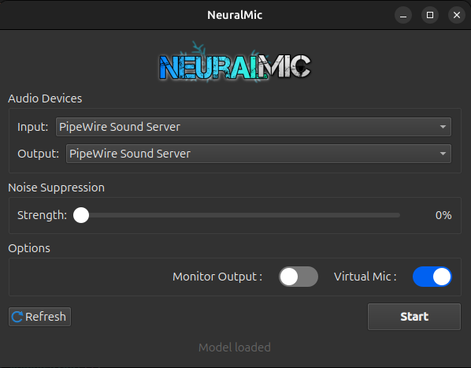

<p align="center">
  
</p>

<h1 align="center"></h1>

<p align="center">
  <strong>Real Time AI based Noise Suppression Client for Linux</strong>
</p>

<p align="center">
  <a href="LICENSE"></a>
</p>

## Overview

NeuralMic is a C++ application that uses [DeepFilterNet](https://github.com/Rikorose/DeepFilterNet) to perform real-time audio noise suppression. It creates a virtual microphone so apps like Discord, Zoom, and others can use your cleaned audio directly. The motivation was for an alternative to NVIDIA's Broadcast but for Linux and Open Source. Currently DeepfilternetV3 is implemented and other models will be added in future.

## Features

- **Real-time noise suppression** via DeepFilterNet V3
- **Virtual microphone output** – works with Discord, Zoom, and any app
- **Qt GUI** with device selection, suppression strength slider, and monitoring toggle
- **Command-line interface** for scripting and file processing
- **Adjustable suppression strength** (0–100%)

<p align="center">
  
</p>

## Quick Start

### Dependencies (Ubuntu/Debian) (Open to Testing on Other Distributions as well)

```bash
sudo apt-get install build-essential cmake g++-13 libsoundio-dev libpulse-dev qt6-base-dev
```

### Build

```bash
git clone https://github.com/yourusername/NeuralMic.git
cd NeuralMic
mkdir build && cd build
cmake ..
make -j$(nproc)
```

ONNX Runtime is downloaded automatically during the CMake step.

### Run

```bash
./NeuralMicGUI
```

## Using with Discord, Zoom, etc.

1. Launch NeuralMicGUI and click **Start**
2. In your app's audio settings, select **"Monitor of NeuralMic"** as the input device
3. Done – your voice now has real-time noise suppression

## CLI Usage

```bash
# Real-time mode (interactive device selection)
./NeuralMic

# Denoise a WAV file
./NeuralMic input.wav output.wav

# Test microphone setup
./NeuralMic --test-mic
```

## Build Options

| Option | Default | Description |
|--------|---------|-------------|
| `BUILD_GUI` | `ON` | Build the Qt GUI application |
| `FETCH_ONNXRUNTIME` | `ON` | Auto-download ONNX Runtime |
| `ENABLE_MP3` | `OFF` | Enable MP3 support (requires `libmp3lame-dev`) |

## Troubleshooting

- **No microphones found** – Check devices with `arecord -l`. Make sure PulseAudio is running.
- **Model loading fails** – Ensure `assets/models/DeepFilterNetV3.onnx` is accessible relative to your working directory.
- **Qt not found** – Install `qt6-base-dev` or point CMake to Qt: `cmake .. -DCMAKE_PREFIX_PATH=/usr/lib/x86_64-linux-gnu/cmake/Qt6`
- **Audio glitches** – Lower the suppression strength, disable monitoring, or close other audio apps.

## Acknowledgments

- [DeepFilterNet](https://github.com/Rikorose/DeepFilterNet) – Neural network model
- [ONNX Runtime](https://github.com/microsoft/onnxruntime) – Inference engine
- [libsoundio](https://github.com/andrewrk/libsoundio) – Audio I/O
- [minimp3](https://github.com/lieff/minimp3) – MP3 decoder
- [Qt](https://www.qt.io/) – GUI framework

## License

[GPL v3](LICENSE)

## Contributing

Contributions are welcome! Feel free to open a Pull Request.

## Roadmap

- [ ] PipeWire virtual device support
- [ ] System tray integration
- [ ] Audio quality metrics display
- [ ] Profile presets
- [ ] Windows and macOS support
- [ ] Plugin system for additional models
